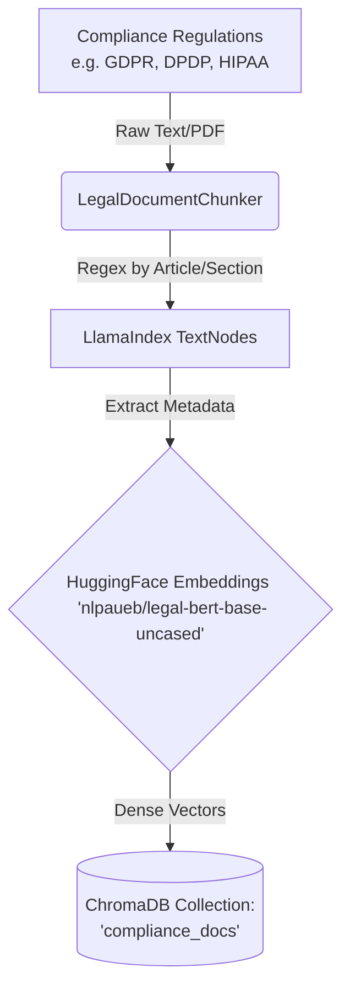

# Layer 1: Policy Ingestion Architecture

This document describes the Layer 1 Ingestion Pipeline of the RAG Compliance Pipeline. It covers the flow for chunking, embedding, and upserting static legal and compliance documents into the vector database.

## Architecture Diagram



## Tools Used

- **Orchestration Framework**: `llama-index` - Used for node (chunk) generation and index management.
- **Vector Database**: `chromadb` - Used as the persistent, local-first vector store (Phase 1) to house the dense legal vectors.
- **Embeddings Pipeline**: `sentence-transformers` via `llama-index-embeddings-huggingface` - Provides localized HuggingFace embeddings without API costs.
- **Embedding Model**: `'nlpaueb/legal-bert-base-uncased'` - An open-source model specifically fine-tuned on legal text, maximizing semantic understanding of complex legal terminologies like 'data subject', 'controller', 'shall', and 'must'.

## The Exact Flow to Upsert Documents

The ingestion of a legal document follows a strict, step-by-step process handled primarily by `ingestion/ingest.py`:

1. **Reading / Loading**:
   - The raw document (e.g., `test_gdpr.txt`) is read from the `compliance_docs/` directory.
   
2. **Context-Aware Chunking**:
   - Instead of breaking the text by arbitrary word counts (which splits legal clauses in half), the text is passed to the `LegalDocumentChunker`. 
   - The Chunker uses regex patterns (e.g., `Article X`, `Section X`) to carefully extract each legal clause as an isolated LlamaIndex `TextNode`.

3. **Metadata Extraction and Tagging**:
   - Metadata is automatically evaluated and tagged to each `TextNode`. 
   - A node will be tagged with its parent `regulation` (e.g., GDPR), `jurisdiction` (e.g., EU), the specific `article` number, and a heuristically determined `requirement_type` based on keyword detection (e.g., identifying if the clause deals with 'consent' or 'cookies').
   
4. **Embedding Generation**:
   - The fully tagged `TextNode` list is passed to the HuggingFace `legal-bert` model wrapper.
   - The model generates a dense floating-point vector (embedding) representing the semantic meaning of that chunk's text and metadata.

5. **Vector DB Upsertion**:
   - Finally, the nodes (text, metadata, and embeddings) are upserted into the `compliance_docs` collection within the local `chromadb` instance. 
   - The database is persistently saved in the `./chroma_db/` folder under the project root.

## Commands to Run

Before running the commands, make sure you've activated the virtual environment where all the ML dependencies are installed:
```bash
source venv/bin/activate
```

**1. To ingest (upsert) a new compliance document:**
```bash
python3 ingestion/ingest.py compliance_docs/test_gdpr.txt --regulation "GDPR" --jurisdiction "EU" --severity "high"
```

**2. To verify and run a test query on the DB:**
```bash
python3 ingestion/test_query.py "What does the law say about tracking users?"
```
